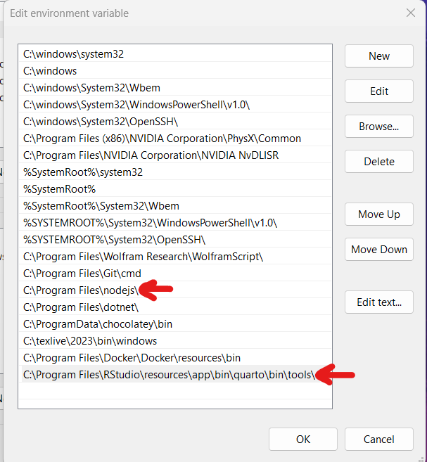

Short Presentation: 
[ATLAS Final Presentation](https://docs.google.com/presentation/d/1sURnbr5knghL71Ta6FU2Ub-EKgcPxsVj16ODFiYFmu4/edit?usp=sharing)

<br />
<br />

To get dependencies for project.

```
npm install
```

Make sure to update system environment variables. Verify all file paths are correct in the scripts.



To execute, run "node main.js".


